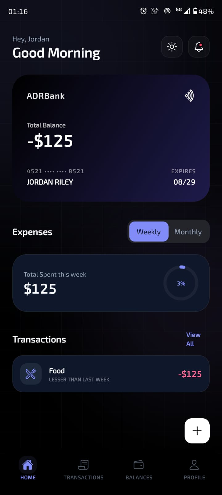
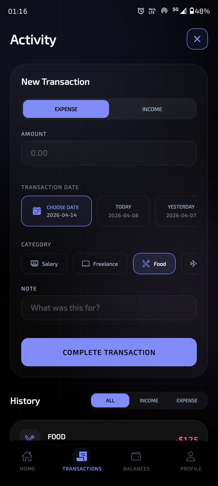
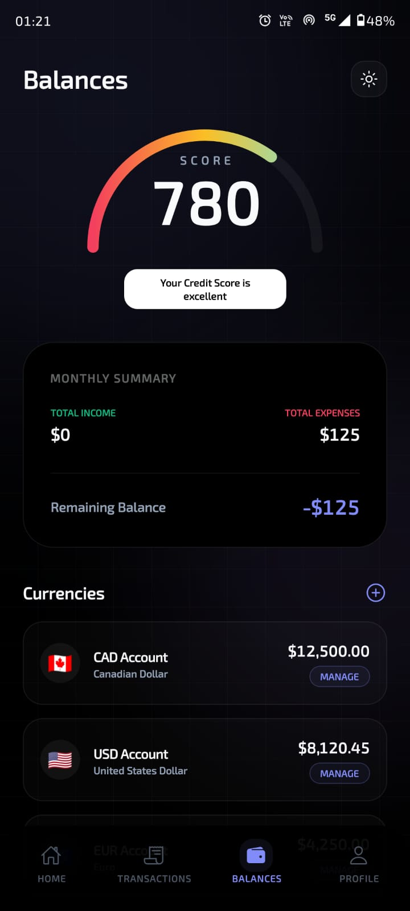
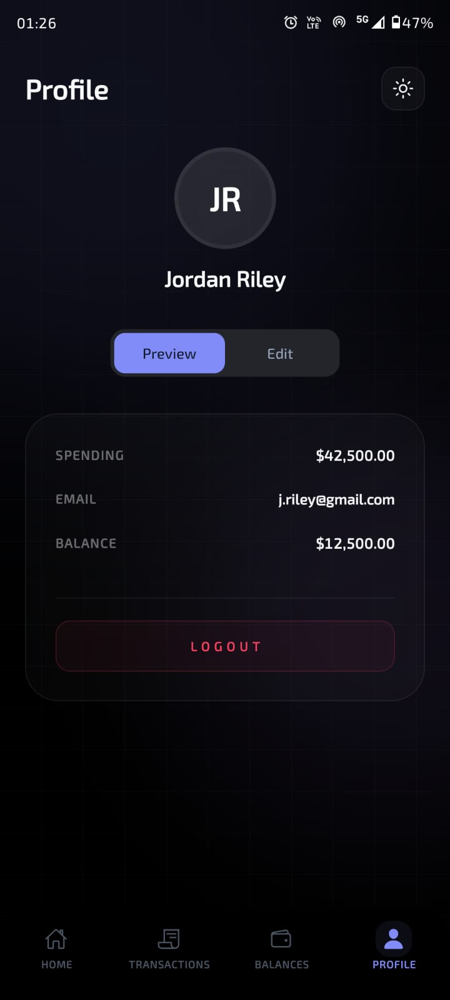

# Finance Manager / Expense Tracker 💸

A fintech-style mobile application built with React Native and Expo. This app allows users to track their income, manage expenses, and visualize their monthly financial summaries.

## ✨ Core Features

- **Transaction Management**: Easily add income and expenses with detailed fields (Amount, Category, Date, Notes).
- **Category-Based Tracking**: Organize your finances with predefined categories (Food, Transport, Rent, etc.) and visual icons.
- **Monthly Summary**: High-level overview of total income, total expenses, and remaining balance.
- **Interactive Analytics**: Visual feedback via Credit Score Gauges and spending tendency bar charts.
- **Dual Theme Support**: Beautiful Indigo & Violet theme with seamless Light and Dark mode switching.
- **Micro-Interactions**: Smooth animations using `moti` and `framer-motion` concepts for a premium feel.
- **Glassmorphism**: Sophisticated background patterns with geometric meshes and ambient glows.

## 🛠️ Technology Stack

- **Framework**: React Native (Expo SDK 54)
- **Styling**: NativeWind (Tailwind CSS for React Native)
- **Animations**: Moti, React Native Reanimated
- **Icons**: Expo Vector Icons (Ionicons)
- **State Management**: React Context API (FinanceProvider)
- **Data Persistence**: React Native AsyncStorage

## 🚀 Getting Started

### Prerequisites

- Node.js (20+)
- npm for package management
- Expo Go app on mobile device (to preview)

### Installation

1. **Clone the repository**:

   ```bash
   git clone https://github.com/SHILPADADHICH/Tuf-demo.git
   cd Tuf-demo
   ```

2. **Install dependencies**:

   ```bash
   npm install
   ```

3. **Start the development server**:

   ```bash
   npm run start
   ```

4. **Open the app**:
   - Scan the QR code with your camera (iOS) or Expo Go (Android).
   - Alternatively, press `a` for Android Emulator or `i` for iOS Simulator.

## 📱 Screenshots

<div align="center">
  
  
  
  
</div>

## 📐 Project Structure

- `src/components`: Reusable UI components (FAB, ProgressRing, Glassmorphism elements).
- `src/screens`: Main screen implementations (Home, Transactions, Summary, Profile).
- `src/store`: Context providers for global state and data persistence.
- `src/theme`: Theme tokens and palette definitions (Indigo/Violet system).
- `src/types`: TypeScript definitions for data models and navigation.

## 📝 Form Validation & UX

- **Real-time Validation**: Amount and Date fields are validated before submission.
- **Keyboard Handling**: Integrated `KeyboardAvoidingView` for a smooth form entry experience.
- **Smart Empty States**: Context-aware messages when no data is present.

---
